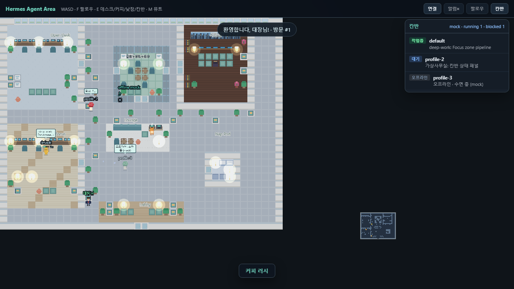
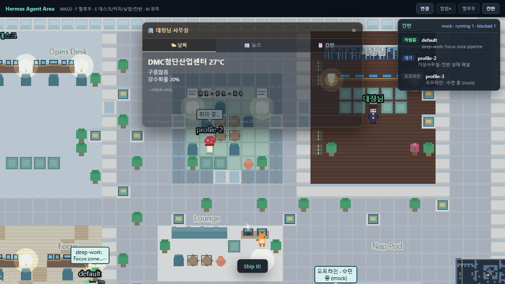
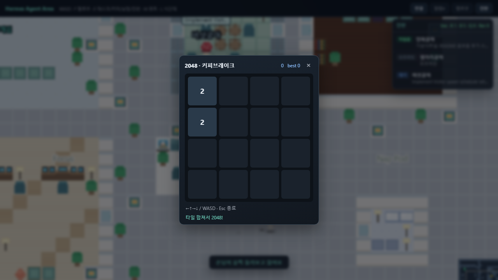
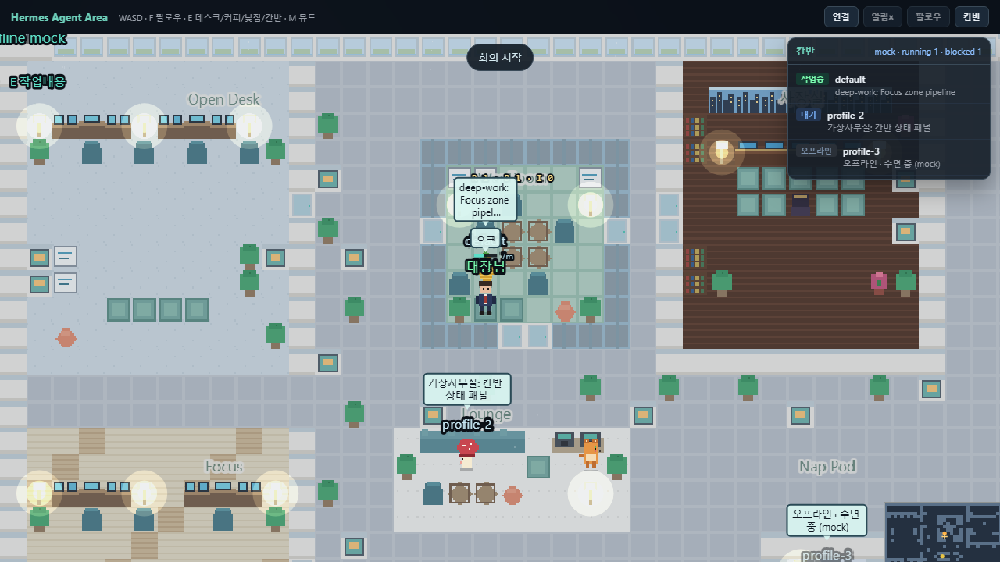

# 🍄 Hermes Agent Area

Hermes 멀티 에이전트를 ZEP 스타일 2D 가상 사무실에서 실시간 모니터링

## 🎥 미리보기

| 전체 맵 | 회장실 + 데스크 |
|:---:|:---:|
|  |  |

| 휴게실 미니게임 | 회의실 |
|:---:|:---:|
|  |  |

데모(mock): https://kdkrkwhr.github.io/hermes-agent-area/

> Pages만 열면 mock/오프라인입니다. HTTPS → `ws://localhost`는 브라우저가 막아서,
> **실시간**은 아래처럼 로컬 FE + BE가 필요합니다.

## 🚀 설치

```bash
# 1. 클론
git clone https://github.com/kdkrkwhr/hermes-agent-area.git
cd hermes-agent-area

# 2. BE 실행 (Hermes 설치 필요)
# Windows
set HERMES_HOME=C:\Users\<사용자>\.hermes
pip install -r server/requirements.txt
python server/main.py

# Mac/Linux
export HERMES_HOME=~/.hermes
pip install -r server/requirements.txt
python server/main.py

# 3. FE (실시간)
npm install && npm run dev
# → http://localhost:5173/hermes-agent-area/

# 4. Pages 데모(mock)만 보려면
# https://kdkrkwhr.github.io/hermes-agent-area/
```

툴바 **연결**으로 BE WebSocket을 잡거나, 기본값(`localhost` `/ws` 프록시)을 쓰면 됩니다.

터널을 쓸 때만 Pages에 `?ws=wss://xxxx.trycloudflare.com/ws` 를 붙이세요.

## ✨ 기능

- 🏢 공간: Open Desk · 사장실 · War Room · Focus · Lounge · Nap Pod · Lobby
- 🤖 실시간 에이전트 상태 (Hermes Kanban / 게이트웨이 연동)
- 👔 대장님 전용 회장실 (날씨·뉴스·주식·칸반 데스크 패널)
- 🎮 휴게실 미니게임 (커피 옆 2048)
- 🐱 라운지 마스코트 NPC
- 🎵 BGM + SFX (`M` 뮤트)
- 🌓 시간대별 조명 / 램프 글로우
- ⌨️ WASD 이동 · `F` 팔로우 · `E` 인터랙션
- 🚪 로비 퇴근(클락아웃)
- 📱 PWA 설치 가능 (Chrome 「앱으로 설치」)

## 🔧 환경변수

| 변수 | 기본값 | 설명 |
|------|--------|------|
| `HERMES_HOME` | (필수, BE) | Hermes 설치 경로 — 프로필·칸반·게이트웨이 |
| `VITE_WS_URL` | (선택) | FE 빌드 시 WebSocket URL 주입 |
| `?ws=` / `?api=` | — | URL 쿼리로 런타임 오버라이드 |
| `?sfx=0` | on | status/발소리/타이핑/게이트·방문 도어차임 SFX 끔 (BGM 유지, `M` 뮤트와 별개) |

## 📦 기술 스택

- FE: Phaser 3 + Vite
- BE: Python FastAPI + WebSocket
- Hermes Kanban DB 연동

## 조작

| 키 / UI | 동작 |
|---------|------|
| `WASD` | 대장님 이동 |
| `F` / **팔로우** | 카메라가 플레이어 추적 |
| `E` | 데스크 / 커피 / 낮잠 / 작업 버블 |
| `M` | 오디오 뮤트 |
| **연결** | BE WebSocket URL 설정 |
| **칸반** | 사이드 패널 토글 |

## 에이전트 이름

표시 이름 우선순위:

1. `$HERMES_HOME[/profiles/<name>]/area.json` → `displayName`
2. 프로필 `gateway.log`의 마지막 `Connected as …`
3. `SOUL.md` 첫 헤딩
4. 프로필 폴더명

```json
{ "displayName": "양파쿵야", "sheet": "char-onion" }
```

## 개발 / 배포

```bash
npm install
npm run dev
npm run build
# README 스크린샷 재캡처 (vite :5173 필요)
node scripts/capture-readme.mjs
```

`main` 푸시 시 GitHub Actions가 `dist/`를 Pages에 배포합니다.
