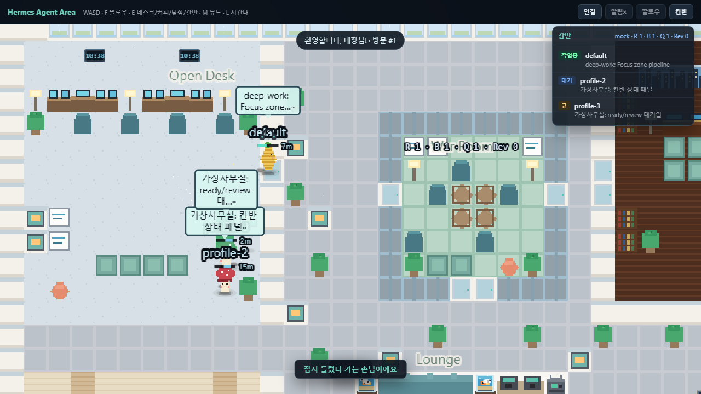
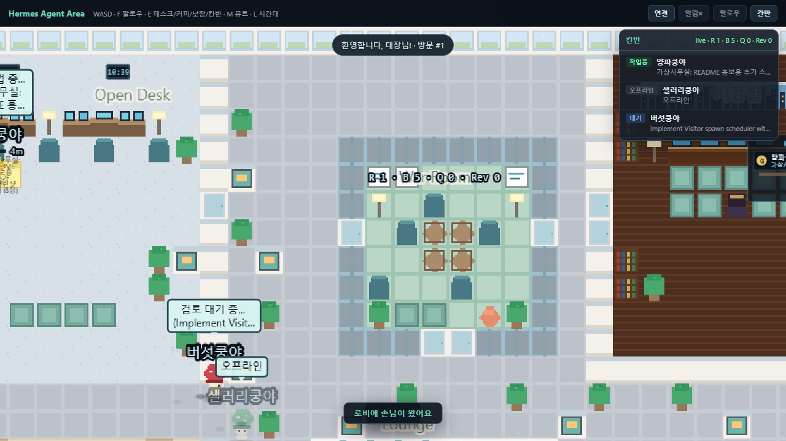
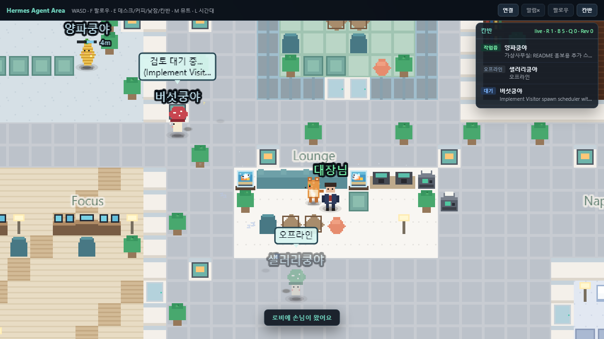
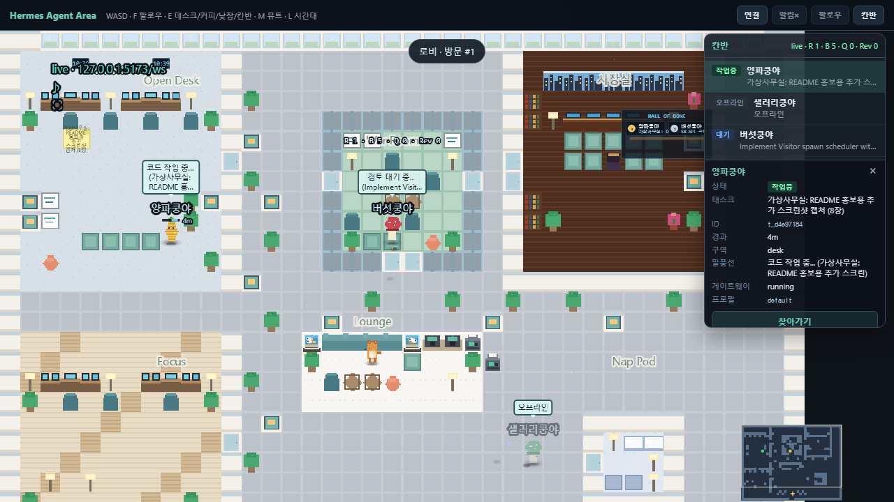
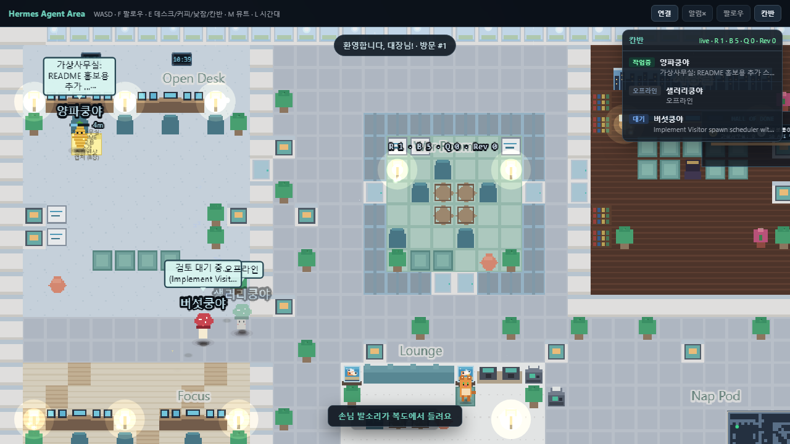
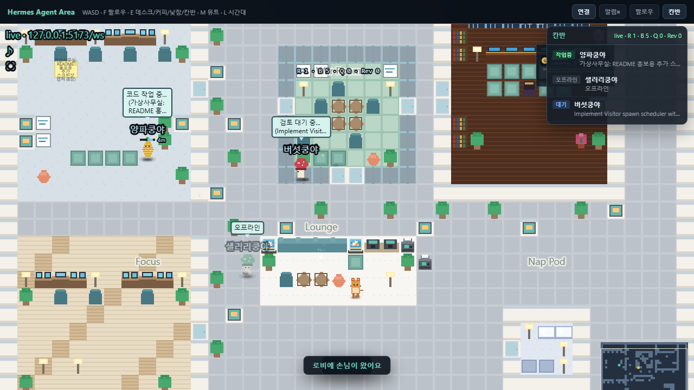
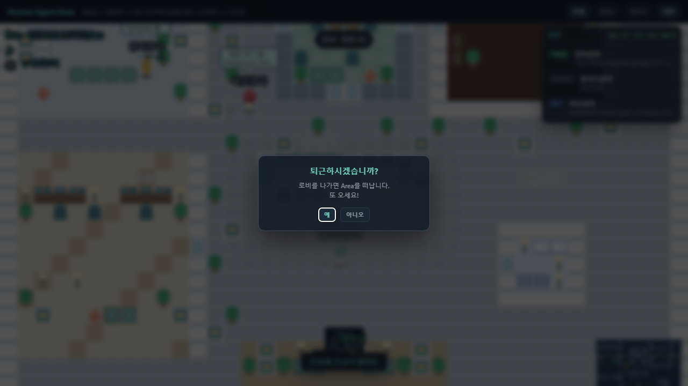
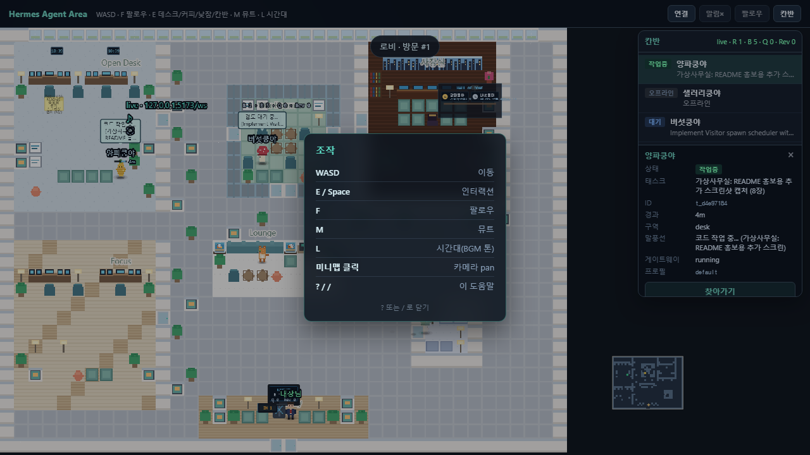

# 🍄 Hermes Agent Area

> Hermes 멀티 에이전트를 2D 가상 사무실에서 실시간으로 만나보세요.

당신의 Hermes 에이전트들이 각자의 업무를 수행하는 모습을 귀여운 픽셀아트 사무실에서 지켜볼 수 있습니다. 회장실 데스크에서 날씨·뉴스·주식·칸반 현황을 확인하고, 휴게실에서 미니게임도 즐겨보세요.

**[👉 데모 보러가기](https://kdkrkwhr.github.io/hermes-agent-area/)** (설치 없이 바로 체험)

> ⚡ **이 프로젝트는 Hermes 에이전트들이 매시간 자동으로 개선하고 있습니다.**  
> 새로운 기능·이펙트·이벤트가 cron을 통해 주기적으로 업데이트됩니다.

---

## 🎥 미리보기

| 전체 맵 | 회장실 데스크 | 에이전트 말풍선 |
|:---:|:---:|:---:|
|  |  |  |

| 휴게실 미니게임 | 날씨 이펙트 | 고양이 마스코트 |
|:---:|:---:|:---:|
|  |  |  |

| 회의실 | 칸반 패널 | 나이트 모드 |
|:---:|:---:|:---:|
|  |  |  |

| 미니맵 | 퇴근 | 도움말 |
|:---:|:---:|:---:|
|  |  |  |

---

## 🚀 3분 만에 시작하기

### 1. 데모만 구경 (30초)

```
https://kdkrkwhr.github.io/hermes-agent-area/
```

브라우저에서 열기만 하면 됩니다. 예시 데이터로 모든 기능을 체험할 수 있어요.

### 2. 내 Hermes 연동하기 (실시간)

```bash
# 클론
git clone https://github.com/kdkrkwhr/hermes-agent-area.git
cd hermes-agent-area

# BE 실행
export HERMES_HOME=~/.hermes          # Windows: set HERMES_HOME=C:\Users\<사용자>\.hermes
pip install -r server/requirements.txt
python server/main.py

# FE 실행
npm install && npm run dev
# → http://localhost:5173
```

끝! 당신의 Hermes 프로필들이 사무실에서 움직이기 시작합니다.

---

## ✨ 기능

### 🏢 공간
| 공간 | 설명 |
|------|------|
| Open Desk | 에이전트 작업 공간 |
| 사장실 | 날씨·뉴스·주식·칸반 대시보드 (`E`키) |
| War Room | 칸반 티커 화이트보드 |
| Focus Zone | 딥워크 전용 데스크 |
| Lounge | 커피머신 + 미니게임(2048) + 마스코트 고양이 |
| Nap Pod | 오프라인 에이전트 Zzz |
| Lobby | 디지털 사이니지 + 퇴근(클락아웃) |

### 🎮 인터랙션
| 키 | 동작 |
|:--:|------|
| `WASD` | 이동 |
| `F` | 카메라 팔로우 |
| `E` | 데스크/커피/낮잠 인터랙션 |
| `M` | 오디오 뮤트 |
| `L` | 시간대 순환 (조명 + BGM 변화) |

### 🎨 이펙트
- 🌓 시간대별 조명 & 램프 글로우
- 🎵 BGM + SFX (발소리, 도어차임, 완료 효과음)
- 🌧️ 날씨 연동 (비/눈/맑음 파티클)
- 🎉 이벤트 (프린터잼, 택배도착, 런치러시, 정전)
- 💬 에이전트 말풍선 & 작업 타이핑 이펙트

---

## 🖥️ 내 Hermes에 100% 호환

> 이 프로젝트는 **하드코딩이 전혀 없습니다.**

```bash
export HERMES_HOME=/아무/경로/.hermes
python server/main.py
```

당신의 프로필, 칸반, 게이트웨이 로그를 실시간으로 읽어서 자동으로 사무실을 구성합니다.  
누구든 자기 Hermes로 바로 쓸 수 있어요.

---

## 📦 기술 스택

| 구분 | 기술 |
|:--:|------|
| FE | Phaser 3 + Vite |
| BE | Python FastAPI + WebSocket |
| 데이터 | Hermes Kanban DB · Gateway Log |
| 배포 | GitHub Pages (FE) + Local BE |

---

## 🔧 에이전트 자동 개선

```
cron (1시간) → 코드 분석 → Kanban 태스크 생성
  → 양파쿵야(Cursor)가 자동 구현 → 배포
```

사무실이 스스로 진화합니다. 새 파티클, 이벤트, UI가 매일 추가돼요.

---

## 🌐 에이전트 이름

BE는 다음 순서로 에이전트 이름을 자동 결정합니다:

1. `area.json` → `displayName`
2. `gateway.log` → Discord `Connected as`
3. `SOUL.md` → 첫 헤딩
4. 프로필 폴더명

```json
{ "displayName": "내에이전트", "sheet": "char-onion" }
```
