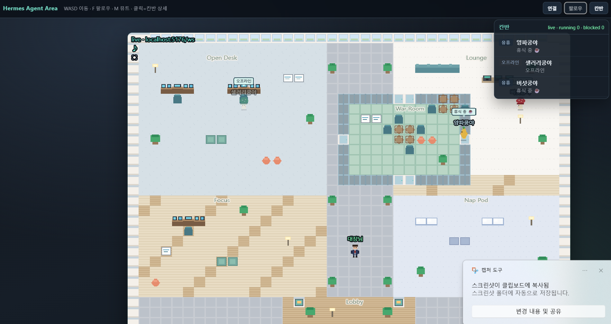
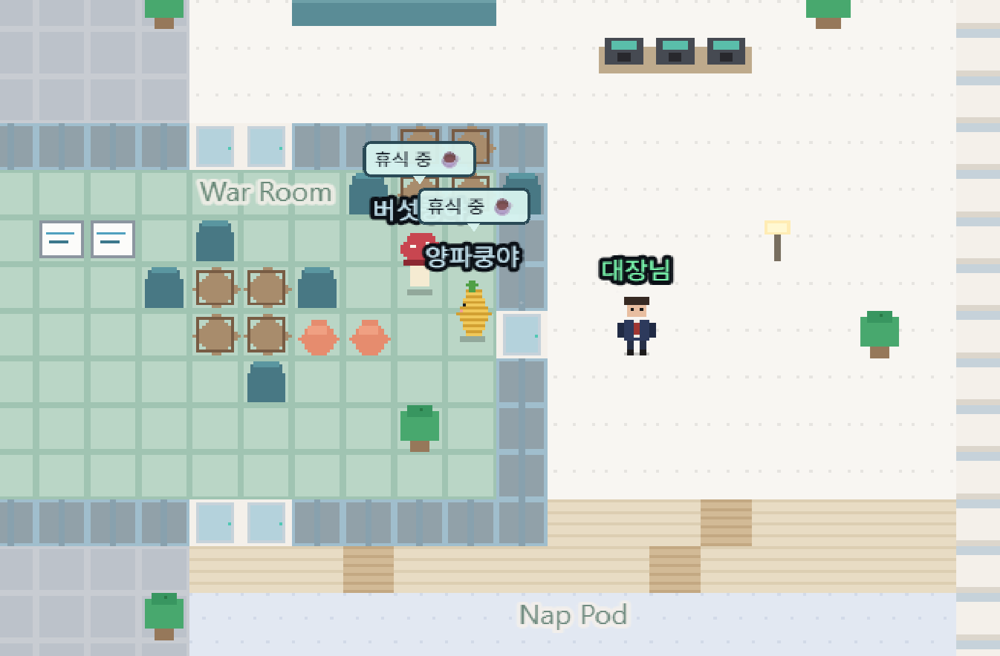

# Hermes Agent Area

Hermes 멀티 에이전트를 **ZEP 스타일 2D 가상 사무실**에서 실시간으로 모니터링하는 웹 앱입니다.

각 PC의 `HERMES_HOME` 프로필·칸반·게이트웨이 상태를 읽어, 에이전트가 책상·워룸·라운지를 오가며 일하는 모습을 한눈에 보여줍니다.





## 이런 걸 볼 수 있어요

| 기능 | 설명 |
|------|------|
| **실시간 상태** | idle / running / blocked / chatting / offline → 캐릭터 위치 + 말풍선 |
| **프로필 기반 캐릭터** | 하드코딩 닉네임 없음. 내 PC Hermes 프로필에서 이름·시트 로드 |
| **칸반 HUD** | running / blocked 수, 에이전트별 작업 요약. 클릭하면 상세 |
| **플레이어(대장님)** | WASD로 이동, `F`로 카메라 팔로우 |
| **휴식 = 라운지 산책** | idle일 때 한 점에 멈추지 않고 휴게 공간을 자유롭게 이동 |
| **구역** | Open Desk · Lounge · War Room · Focus · Nap Pod · Lobby |
| **오프라인 미리보기** | BE 없이도 mock으로 맵·UI 확인 가능 (GitHub Pages) |

## 구조

```
GitHub Pages (프론트 정적)  ←── 실시간 X (HTTPS → localhost WS 차단)
        │
        └── live 보려면 → 로컬 FE (Vite) + 로컬 BE (Python)
                              │              │
                              └── /ws 프록시 ─┘
                                    │
                              HERMES_HOME (프로필 · kanban.db · gateway)
```

- **프론트:** Phaser 3 + Vite → GitHub Pages (`kdkrkwhr.github.io/hermes-agent-area/`)
- **백엔드:** FastAPI WebSocket → 로컬에서만 실행 (각자 Hermes 홈 연결)

## 빠른 시작

```bash
git clone https://github.com/kdkrkwhr/hermes-agent-area.git
cd hermes-agent-area

# BE (Hermes 상태 브릿지)
# Windows: set HERMES_HOME=D:\develop\e2e\hermes
export HERMES_HOME=~/.hermes
pip install -r server/requirements.txt
python server/main.py

# FE (실시간)
npm install && npm run dev
# → http://localhost:5173/hermes-agent-area/
```

툴바 **연결**으로 BE WebSocket을 잡거나, 기본값(`localhost` `/ws` 프록시)을 쓰면 됩니다.

> **Pages만 열면** mock/오프라인입니다. 브라우저가 `https` → `ws://localhost`를 막아서,
> 실시간 모니터링은 **로컬 FE + BE**가 필요합니다.
> 터널을 쓸 때만 Pages에 `?ws=wss://xxxx.trycloudflare.com/ws` 를 붙이세요.

## 에이전트 이름 (Hermes 프로필)

표시 이름 우선순위:

1. `$HERMES_HOME[/profiles/<name>]/area.json` → `displayName`
2. 해당 프로필 `gateway.log`의 마지막 `Connected as …`
3. `SOUL.md` 첫 헤딩
4. 프로필 폴더명 (`default`, `nous-work`, …)

```json
// 예: ~/.hermes/area.json  (default 프로필)
{ "displayName": "양파쿵야", "sheet": "char-onion" }
```

## 조작

| 키 / UI | 동작 |
|---------|------|
| `WASD` | 대장님 이동 |
| `F` / **팔로우** | 카메라가 플레이어 추적 |
| `M` | 오디오 뮤트 |
| **연결** | BE WebSocket URL 설정 (localStorage 저장) |
| **칸반** | 사이드 패널 토글 |
| 캐릭터/칸반 클릭 | 작업 상세 |

## WebSocket

| 경로 | 용도 |
|------|------|
| `ws://localhost:5173/ws` | 로컬 FE → Vite가 BE로 프록시 |
| `ws://127.0.0.1:8765/ws` | BE 직접 연결 |
| `?ws=` / `?api=` | URL 쿼리로 오버라이드 |
| `VITE_WS_URL` | `.env` 빌드 시 주입 |

## 개발 / 배포

```bash
npm install
npm run dev
npm run build
```

`main` 푸시 시 GitHub Actions가 `dist/`를 Pages에 배포합니다.

라이브 미리보기: https://kdkrkwhr.github.io/hermes-agent-area/
